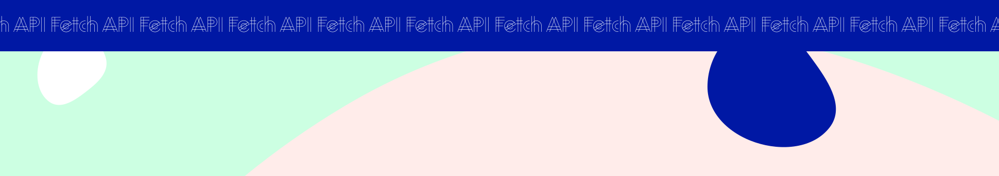

<h1 align="center">
  
</h1>

# Fetch API

For this week's team session, you will practice fetching data from an open Pokemon API.
The goal is to change the content of our mystery table in HTML to contain info about one specific Pokemon. This will be done during the scheduled team session, you decide in the team if you do it in small groups or pairs.

### Instructions:

Take a look into the `index.js` file and follow the instructions to complete the exercises from 1-6 (the last exercise is a bonus).

## Getting Started with the Project

Fork this repository and start working in your local environment (you can download LiveServer to run your project locally).
